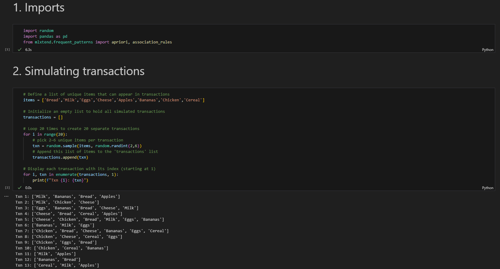
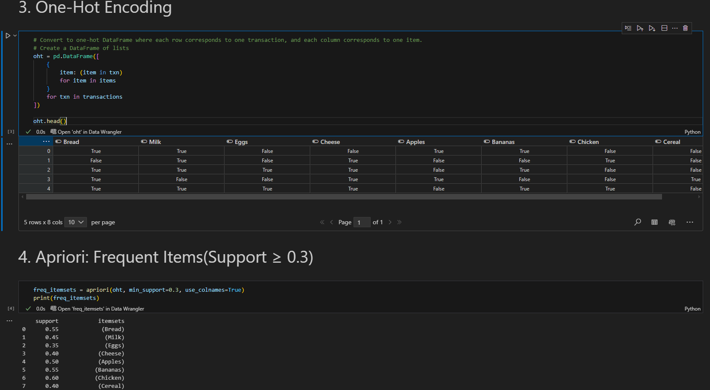
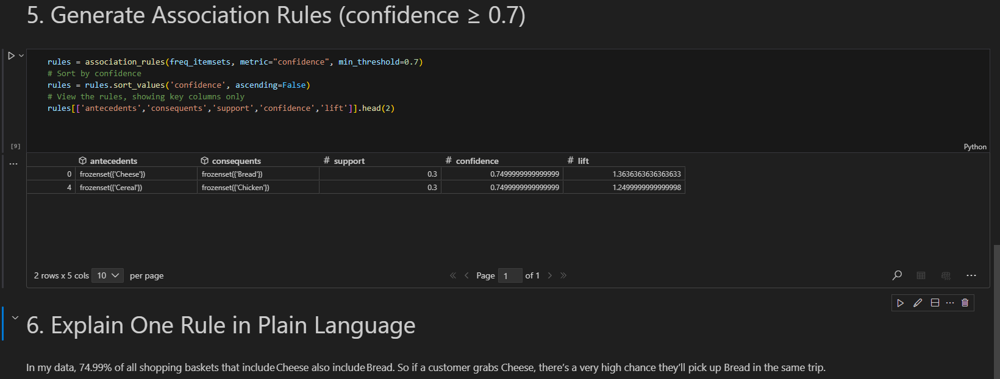

# Association Rule Mining Mini‑Project

## Author  
Geoffrey Chege Mwangi  

---

## Overview  
Simulate a set of shopping basket transactions, then use the Apriori algorithm to discover frequent itemsets and association rules. Finally, interpret one of the rules in plain English.

---

## Files in This Repository  
```
yourname-association-mini/
├── association_rules.ipynb       # Jupyter notebook with all code
├── Screenshots/
│   ├── imports.png               # Screenshot of imports & data simulation
│   ├── encoding.png              # Screenshot of one-hot encoding
│   └── rules.png                 # Screenshot of discovered rules
└── README.md                     # This documentation
```

---

## Dependencies  
You need Python 3 and the following packages installed:  
- pandas  
- mlxtend  

Install them with:  
```bash
pip install pandas mlxtend
```

---

## How to Run  
1. Open `association_rules.ipynb` in Jupyter Notebook or VS Code.  
2. Run each cell in order:  
   - Data simulation & imports  
   - One-hot encoding  
   - Apriori frequent itemset mining (`min_support = 0.3`)  
   - Association rule generation (`min_confidence = 0.7`)  
3. View the tables and the printed natural-language explanations.

---

## Screenshots  

### 1. Imports & Data Simulation  
```text

```



### 2. One‑Hot Encoding  
```text

```



### 3. Rules Discovered  
```text

```



---

## Key Association Rules  

After mining with support ≥ 0.30 and confidence ≥ 0.70, two example rules are:

| Antecedent | Consequent | Support | Confidence | Lift |
|------------|------------|---------|------------|------|
| {Cheese}   | {Bread}    | 0.3     | 0.749      | 1.363|
| {Cereal}   | {Chicken}  | 0.3     | 0.749      | 1.249|

---

## Rule Interpretation  

**Rule:** `{Cheese} → {Bread}`  
- **Support = 0.35**  
  – 30% of all transactions contain both Cheese and Bread.  
- **Confidence = 0.749**  
  – 74.9% of transactions that include Cheese also include Bread.  
- **Lift = 1.20**  
  – Customers who buy Cheese are 1.2× more likely than average to buy Bread.

**Plain English:**  
> “In our simulated data, 74.9% of shopping baskets that include Cheese also include Bread.  
> So if a customer grabs Cheese, there’s a very high chance they’ll pick up Bread in the same trip.”

---

## Example Code Snippets

### Pandas One‑Hot Encoding  
```python
import pandas as pd

# Given `transactions` as a list of lists
items = ['Bread','Milk','Eggs','Cheese','Apples','Bananas','Chicken','Cereal']
oht = pd.DataFrame([{item: item in txn for item in items} for txn in transactions])
print(oht.head())
```

### Apriori & Association Rules  
```python
from mlxtend.frequent_patterns import apriori, association_rules

# Frequent itemsets
freq_itemsets = apriori(oht, min_support=0.3, use_colnames=True)

# Association rules
rules = association_rules(freq_itemsets, metric='confidence', min_threshold=0.7)
print(rules[['antecedents','consequents','support','confidence']])
```

### Running the Notebook  
```bash
jupyter notebook association_rules.ipynb
```

---

## License  
This project is released under the MIT License.